## 学习 Qt 的过程中写的几个小项目

- 系统环境：Windows  
- Qt 版本：5.9.6   

### 项目一：汽车销售管理系统

#### 1. 功能介绍

- 运行程序后会出现登录界面，需要输入密码才能登录，密码默认**123456**  
- 进入主界面后有两个菜单：“销售管理”和“修改密码”，“销售管理”主菜单下又包含3的子菜单：
  - **品牌车管理**：实现不同厂商不同品牌汽车的管理和出售操作以及当日的销售纪录
  - **销售统计**：实现各款车的销量的图表显示
  - **退出**：退出程序  

#### 2. 界面设计

**品牌车管理：**  

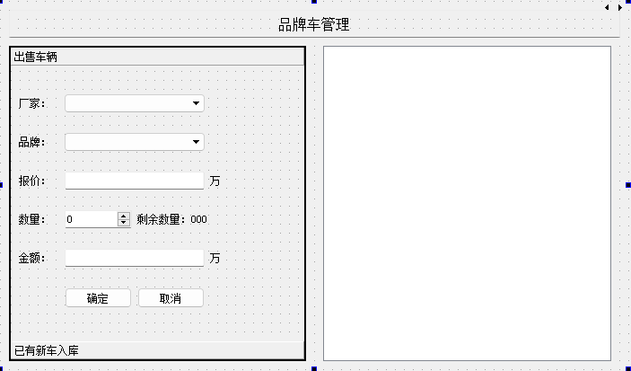  

**销售统计：**  

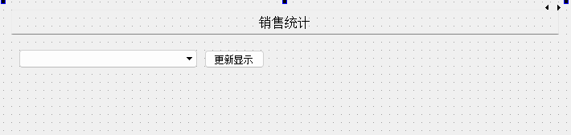    

#### 3. 文件说明

- connection.h :  创建数据库表和销售清单xml文件；  
- pieview.h && pieview.cpp：销售统计图表相关操作；  
- logindialog.h && logindialog.cpp: 登录对话框相关操作；  
- widget.h && widget.cpp: 页面主要组件相关操作  
- .ui文件: UI界面  
- main.cpp: 主函数  

#### 4. 运行效果

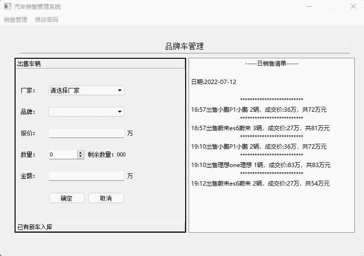  

### 项目二：小小计算器  

#### 1. 功能介绍  

- 计算加减乘除；  
- 按 OK 计算所有算式结果总和；    
- 添加算式；清空；  

#### 2. 界面展示  

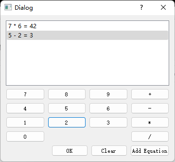  

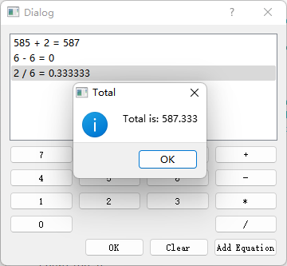    

### 项目三：TodoList  

#### 1. 功能介绍  

- 添加待做事项以及设置事项状态（完成，部分完成，未完成）  
- 保存当前状态事项列表为 .td 文件以及读取旧文件  

#### 2. 界面展示

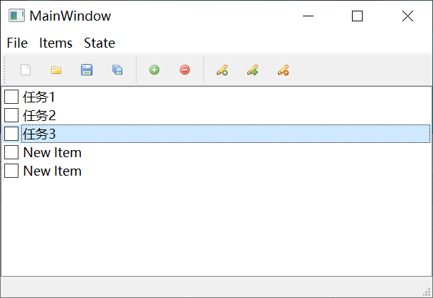  

### 项目四：Tcpclient

#### 1. 功能介绍  

-  与 TCP 服务器建立连接  
- 与 TCP 服务器通信  
- 设置通信使用的用户名

#### 2. 界面展示  

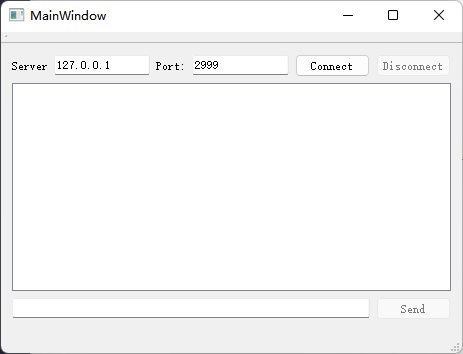  

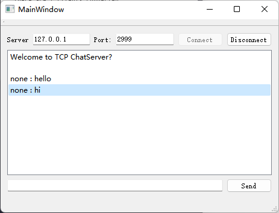  

### 项目五：TCPserver

#### 1. 功能介绍  

- 设置端口号  
- 设置欢迎信息  
- 等待用户建立通信  

#### 2. 界面展示  

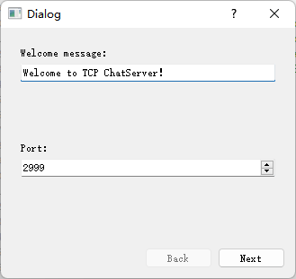  

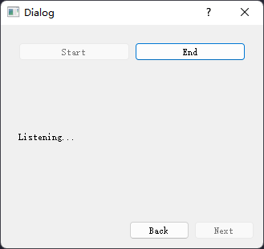  

### 项目六：商品管理系统  

#### 1. 功能介绍  

- 展示商品名称、数量、图片  
- 添加、删除商品  
- 编辑选定商品信息  
- 保存，载入商品信息  

#### 2. 界面展示  

主界面：

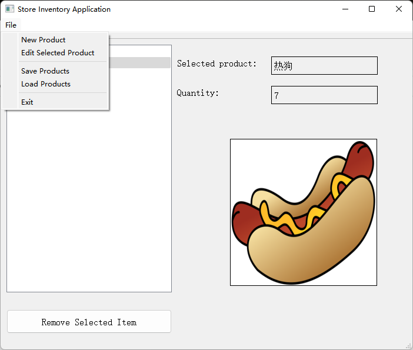  

添加商品界面：  

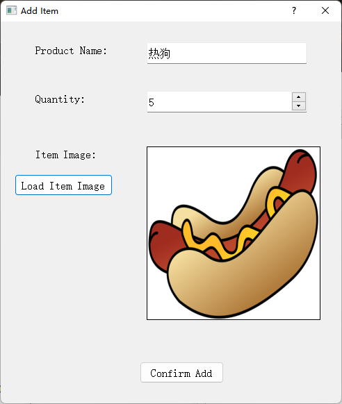  

修改商品信息界面：  

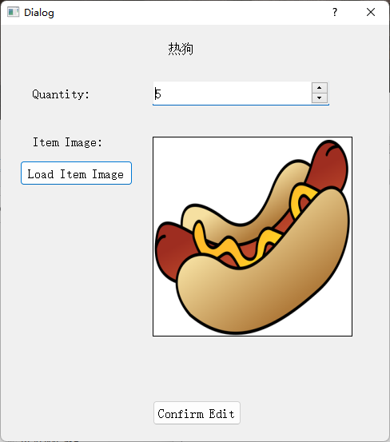  

  

